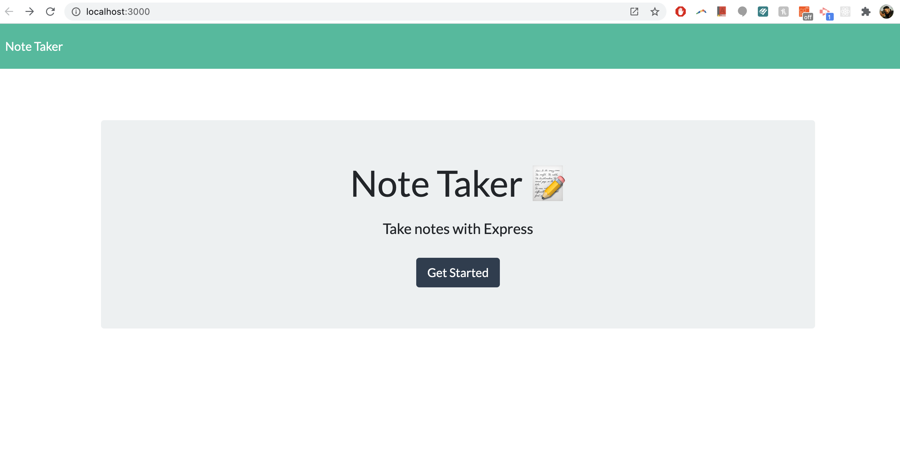

# Fancy Note Taker 📓 🖊️

## Description
This browser application allows you to create, store, edit, and delete notes. Each note has its title and content for easy identification. Intuitive icons help you use the application. Created notes are displayed in the panel on the left side of the browser. The actual content is displayed in the main container.

## Table of Contents
* [Installation](#Installation)
* [Usage](#Usage)
* [License](#License)
* [Contributing](#Contributing)
* [Test](#Test)
* [Questions](#Questions)

## Installation

This application runs on Heroku server under the link below:

https://serene-oasis-86335.herokuapp.com/

## Usage
Click the following link to use the app. Click the icons in the top panel to create and edit notes. Click the trash icon next to the note to delete the note. You can also install this app by downloading it from the Github repository (clone). Then enter `npm install express` to install the express dependecy that will allow you to run the express server. After that enter `node app.js` to invoke the app in the VS Code terminal. Click the link displayed to you in the terminal to use the app in the browser through local host.

  

## License
This application is covered under the MIT license.

## Contributing
If you would like to contribute to this project, please let me know.

## Test
Testing framework used: TBD

## Questions
If you have additional questions, you can reach me via my GitHub profile: [peterdudek](https://github.com/peterdudek) 
or send me an email at: piotr72@gmail.com
